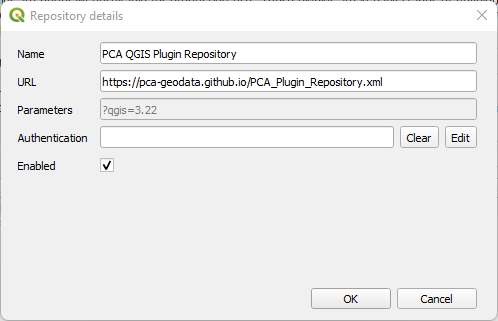

<h1>      PCA QGIS Plugin Repository</h1>

This is the official Pre-Construct Archaeology Ltd QGIS Plugin repository. 
The repository can be accessed online on  <a href="https://pca-geodata.github.io">PCA QGIS Plugin Repository</a></strong>

It contains the plugins built by the GeoSpatial Data Department for specific internal workflows (e.g., Geomax survey processing or Post-excavation workflow). 

## How to use on QGIS
The repository can be also added to the Plugin Repositories on the QGIS Plugin Manager.

To add the repository to QGIS: "Plugins" - "Manage and install plugins..." - "Settings" - "Add...".

Name: PCA QGIS Plugin Repository

URL: https://pca-geodata.github.io/PCA_Plugin_Repository.xml 

 

For any further information or plugin development requests contact <a href = "mailto: abc@example.com"><strong>vpinna@pre-construct.com</strong></a>
 or open a Feature Request in this page.

## License
<strong>All content is licensed under <a href="https://creativecommons.org/licenses/by-sa/3.0/"> Creative Commons Attribution-ShareAlike 3.0 licence (CC BY-SA)</a>.<strong>

